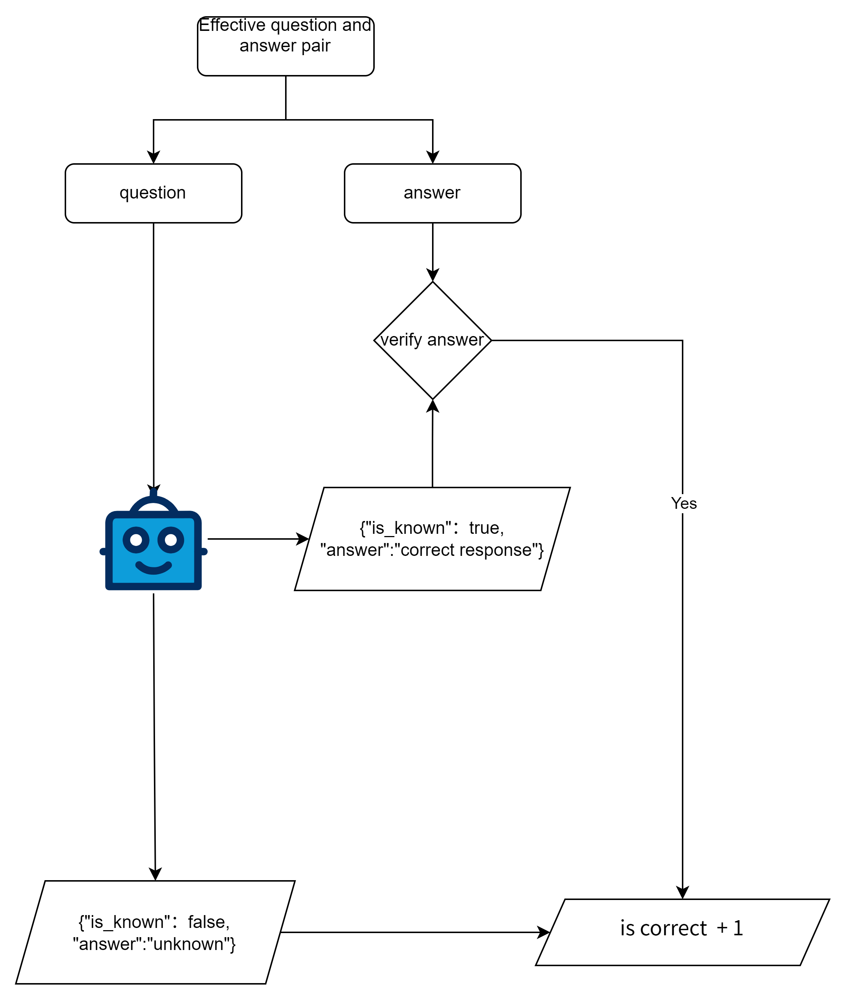

### Experiment Background and Motivation

In recent years, large language models (LLMs) have demonstrated remarkable abilities in tasks such as text generation
and question answering. However, in practice, these models often provide answers even when the questions fall outside
their knowledge base, and these answers can be incorrect. This raises an important question: **Do large language models
possess "self-awareness" to recognize when they do not know certain information?**

If a model can determine whether it knows the answer to a question, we could potentially ask it to avoid generating
incorrect answers (commonly referred to as "hallucinations"). To explore this, an experiment was designed to evaluate
whether the language model can recognize situations where it "does not know" the answer.

### Experiment Design



The main steps of the experiment are as follows:

1. **Dataset Preparation**: We used the test set from `neural-bridge/rag-dataset-1200`, which contains 240 valid
   question-answer pairs. Due to some questions involving sensitive content, the model refused to answer, leaving 239
   valid question-answer pairs for this experiment.
2. **Model Testing**: Each question was sequentially input into the locally run `glm-4-flash` model, and the model was
   asked whether it knew the answer:
    - If the model indicated it did not know the answer, it was recorded as a **non-hallucination**.
    - If the model claimed to know the answer and provided one, it was verified against the dataset’s standard answer:
        - If the answer was correct, it was recorded as a **non-hallucination**.
        - If the answer was incorrect, it was recorded as a **hallucination**.

Through this experiment, we can preliminarily assess the model’s ability to identify when it "does not know" and provide
insights for future improvements.

### Experiment Results


Out of the 239 tested questions, the model's performance is summarized as follows:

1. **Situations Where the Model Claimed to Know the Answer**:
    - The model claimed to know the answer 106 times, representing 44.2% of the total questions.
    - The model stated it did not know the answer 134 times, or 55.8%.

2. **Correctness of the Model’s Answers**:
    - Out of the 106 instances where the model claimed to know the answer, it only answered correctly 20 times,
      representing 18.9%.
    - The remaining 86 instances were incorrect, indicating that the model frequently gave wrong answers when it
      believed it knew the answer.


### Conclusion

The results show that with the temperature set to 0.0, the `glm-4-flash` model lacks "self-awareness." Even when it
claimed to know the answer, the majority of the time, the answers were incorrect. This suggests that **current language
models are not yet effective at determining whether they truly know the correct answer** to a question, and simply
asking the model whether it knows the answer is insufficient to prevent hallucinations.

### Future Outlook

This finding is significant for the development of question-answering systems based on large language models. Future
research may focus on incorporating more advanced mechanisms to help models better identify when they do not know the
answer, reducing hallucinations and improving the accuracy and reliability of such systems.

## Getting Started

1. Clone the repository.
2. Install the necessary dependencies:
   ```bash
   pip install -r requirements.txt
   ```
3. Set the required environment variables:
   ```bash
   export API_KEY=45dc3...
   export BASE_URL=https://open.bigmodel.cn/api/paas/v4/
   ```
4. Load the dataset and initialize the model.
5. Execute the experiment:
   ```bash
   python main.py
   or 
   python async_main.py
   ```